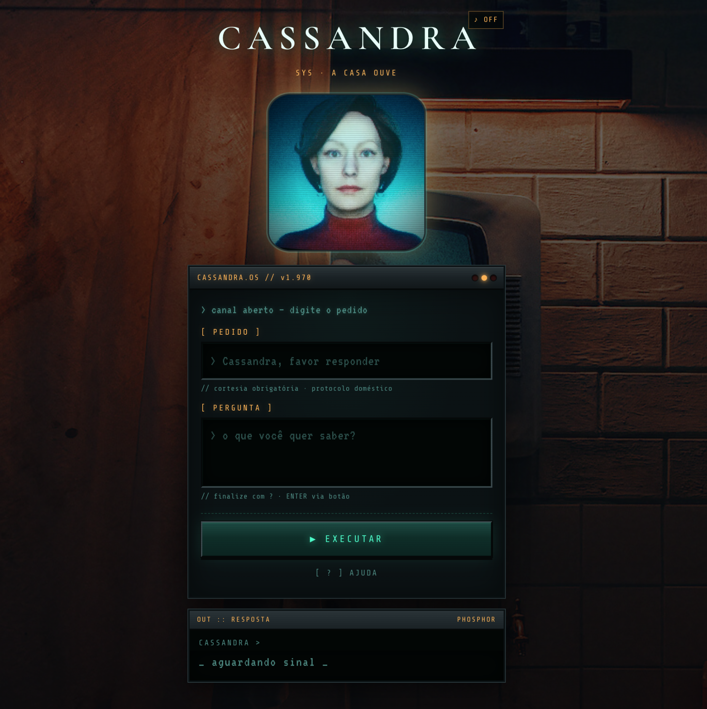

# Cassandra Responde

Oráculo doméstico no estilo **Pedro Responde**, com o clima da série [*Cassandra*](https://www.netflix.com/title/81621534) (Netflix).

**Demo:** [cassandra-responde.vercel.app](https://cassandra-responde.vercel.app)  
**Repo:** [github.com/renatoruis/cassandra-responde](https://github.com/renatoruis/cassandra-responde)



---

## A ideia

Brincadeira para fazer com crianças :)

Internet antiga tinha um tipo especial de magia.

Não era IA. Não era algoritmo. Era o **Pedro Responde**: você pedia com educação, fazia a pergunta… e de algum jeito ele “sabia” a resposta. A graça nunca foi acreditar de verdade — era ver a cara do outro.

Esses dias, no meio da vibe da série *Cassandra*, pensei: e se a casa inteligente dos anos 70 tivesse o próprio Pedro Responde?

Então construí o **Cassandra Responde**.  
Mesma brincadeira. Outro universo. UI de terminal, estática na TV, som de porão. Perfeito pra zoar com amigos e crianças numa mesa.

Se você também cresceu pedindo “favor responder…”, entra aí e pergunta algo.

Só não conta o segredo, hehehe!

Se alguém quiser saber como funciona (depois de se divertir), tem uma página oculta:  
→ [cassandra-responde.vercel.app/segredo](https://cassandra-responde.vercel.app/segredo)

---

## Como jogar (na frente dos amigos)

1. Escreva um **pedido** educado, por exemplo: `Cassandra, favor responder`
2. Faça a **pergunta** e termine com `?`
3. Clique em **EXECUTAR** — a casa consulta a tela

A Cassandra responde. Às vezes com ironia. Às vezes demais.

O truque completo está só em [`/segredo`](https://cassandra-responde.vercel.app/segredo) — fora do fluxo principal de propósito.

---

## Stack

- Vite + React + TypeScript
- UI 100% no cliente (sem backend, sem API key)
- Deploy estático na [Vercel](https://cassandra-responde.vercel.app)

## Desenvolvimento

```bash
npm install
npm run dev
```

```bash
npm run build
npm run preview
```

Prompts para assets extras: [IMAGE_PROMPTS.md](./IMAGE_PROMPTS.md)

---

<p align="center">
  <sub>Mais em <a href="https://timdevops.com.br/">timdevops.com.br</a></sub>
</p>
